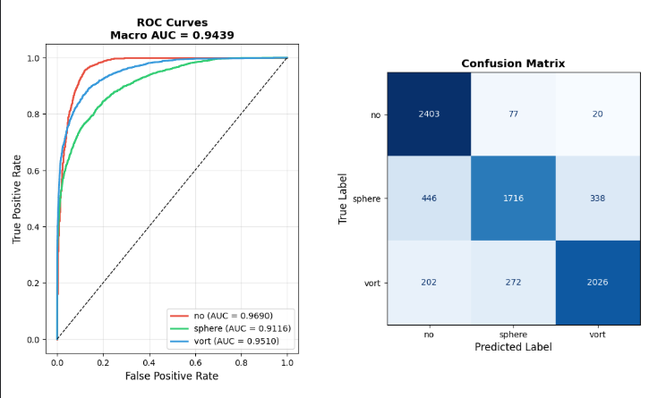

# Neural Operator Classifier

Gravitational lensing image classifier using a **Fourier Neural Operator (FNO)** augmented with an EfficientNet-B0 backbone.

---

## Architecture

Two parallel branches process each input image independently, then their features are concatenated into a shared classification head.

**FNO branch** — replaces spatial convolutions with spectral convolutions. Each block applies a learned linear map in the truncated Fourier basis (`rfft2` → complex weight multiply → `irfft2`), plus a pointwise bypass conv and GroupNorm. This gives a global receptive field from the very first layer. Config: width=48, modes=12, 4 blocks.

**CNN branch** — EfficientNet-B0 pretrained on ImageNet, frozen during the first 5 warmup epochs then fine-tuned at 10× lower learning rate. The 1-channel input is replicated to 3 channels inside `forward()` and ImageNet-normalized before passing to EfficientNet. Outputs a 1280-dim feature vector.

**Head** — `Linear(1280 + 768, 512) → Linear(512, 256) → Linear(256, 3)` with GELU activations and dropout.

---

## Why FNO for Lensing

Gravitational lensing arcs are global, ring-like features. Different substructure types produce distinct spectral signatures:

- **No substructure** — smooth Einstein ring, power concentrated in low Fourier modes
- **Subhalo** — localized arc perturbations, mid-frequency distortions
- **Vortex** — spiral angular patterns, specific angular-frequency signatures

Standard CNNs learn these implicitly by stacking local kernels. FNO learns them directly, one mode at a time.

| Property | FNO branch | EfficientNet-B0 |
|---|---|---|
| Receptive field | Global from layer 1 | Grows with depth |
| Frequency handling | Explicit per-mode weights | Implicit via stacking |
| Complexity per layer | O(N log N) | O(N · k²) |
| Pretraining | From scratch | ImageNet pretrained |
| Inductive bias | Periodic translation equivariance | Local translation equivariance |

---

## Results

| Task | Model | Macro AUC |
|---|---|---|
| Common Test I | EfficientNet-B0 standalone | 0.9741 |
| Specific Test IV | EfficientNet-B0 + FNO hybrid | 0.7744 |

The FNO branch trains from scratch — no pretrained FNO weights exist for scientific imaging. The gap relative to the CNN baseline reflects this, not a fundamental limitation of the spectral approach.

Per-class AUC: `no` = 0.8466, `sphere` = 0.6915, `vort` = 0.7852

---

## Training Details

- **Optimizer**: AdamW, two param groups (CNN: LR×0.1, FNO: LR=2e-4)
- **Scheduler**: OneCycleLR stepped per batch, 15% warmup
- **Augmentation**: horizontal/vertical flip, random rot90, Gaussian noise σ=0.02
- **Regularization**: label smoothing 0.1, dropout 0.3/0.2, grad clip 0.5
- **Epochs**: 70, batch size 128, image size 64×64

---

## Limitations

- FNO trains from scratch vs. EfficientNet which starts from ImageNet — the comparison favors the CNN baseline.
- Increasing `FNO_WIDTH` to 128 or applying spectral convolutions to intermediate CNN feature maps (rather than raw input) would likely improve results with more compute.
